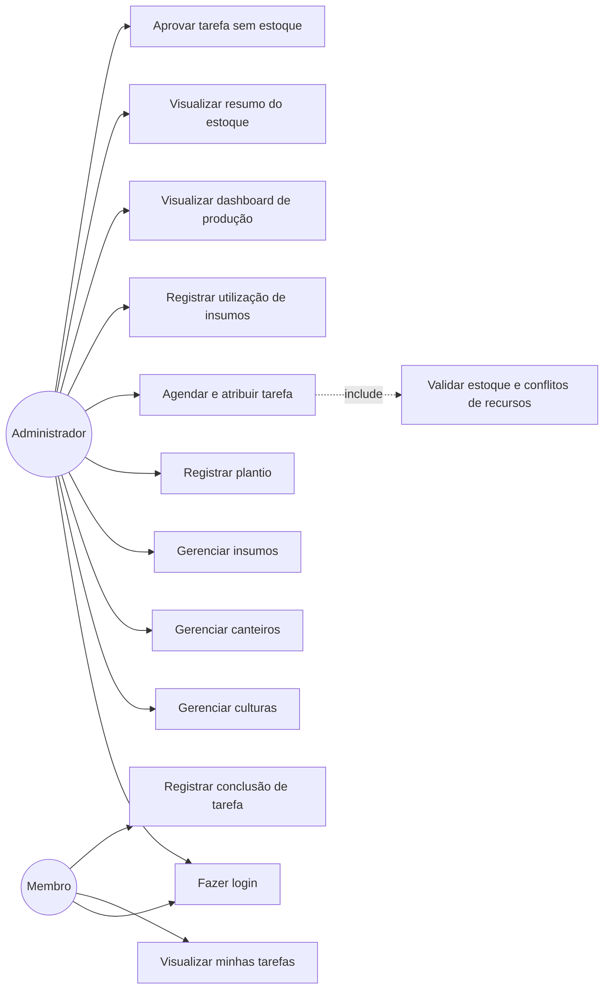
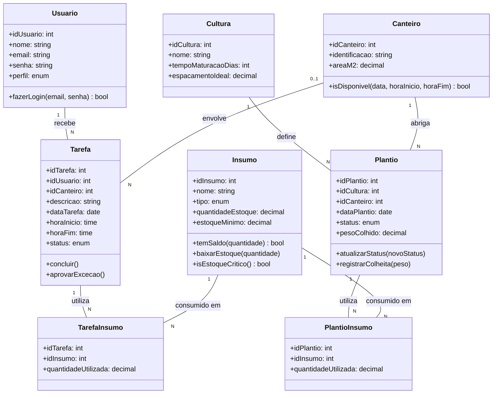

# Diagramas UML — Horta Familiar

## 1. Diagrama de Casos de Uso

## 2. Diagrama de Classes

## 3. Rastreabilidade — caso de uso → história do backlog

| Caso de uso | História(s) relacionada(s) (E2) |
|---|---|
| Fazer login | #1 |
| Gerenciar culturas | #2 |
| Gerenciar canteiros | #3 |
| Gerenciar insumos | #4 |
| Registrar plantio | #5 |
| Agendar e atribuir tarefa + Validar estoque e conflitos | #6, #10, #11 |
| Visualizar minhas tarefas | #7 |
| Registrar conclusão de tarefa | #8 |
| Registrar utilização de insumos | #9 |
| Visualizar dashboard de produção | #12 |
| Visualizar resumo do estoque | #13 |
| Aprovar tarefa sem estoque | #14 |

